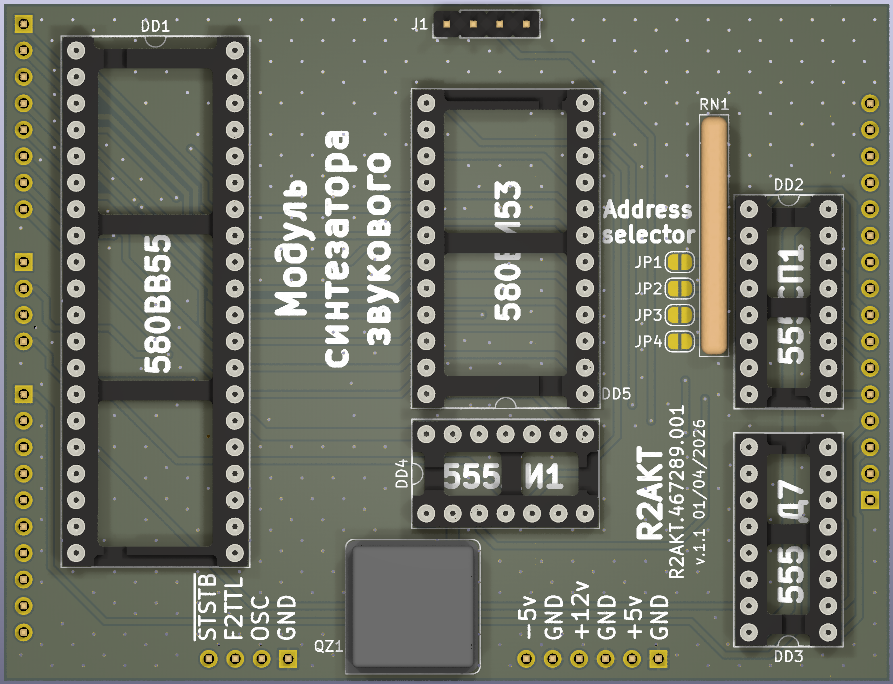

License addendum - https://github.com/R2AKT/SysTick/blob/main/Addendum.txt

# Smyk

Sound synthesizer module (Smyk). For Mega-80 (Mega-580) DIY 8-bit micro-computer - https://github.com/R2AKT/Mega-80.

Generation of 3-channel 1-bit sound.

Based on 580VI53 (8253).

Status: In the process of testing.

Модуль синтезатора звукового (Smyk). Для самодельной 8-битной микро-ЭВМ - https://github.com/R2AKT/Mega-80.

Генерация 3-х канального 1-битного звука.

На основе 580ВИ53 (8253).

Статус: В процессе тестирования.
